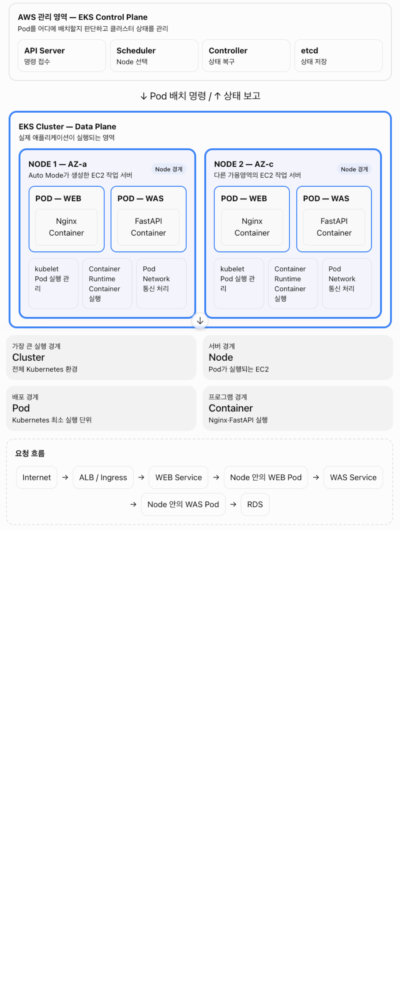
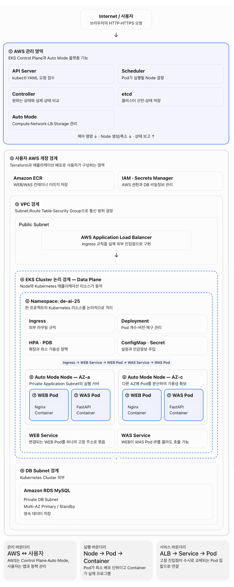

# 목표
- v1 버전기반 쿠버네티스 도입, 구조 변경, 새로운 개념 정리(운영/관리)
- 쿠버네티스를 디테일하게 직접 구성 or [v]auto mode로 구성(관리파트) -> EKS, ECR 활용

# 쿠버네티스
- 컨테이너를 여러 서버에 배치, 장애 발생시 복구, 트레픽에 따라 확장/감소하는 시스템
- 수많은 컨테이너화된 애프리케이션의 배포, 확장, 관리을 자동화하는 오픈소스 기반의 `컨테이너 오케스트레이션 표준 플랫폼`
- 여러 서버(물리/가상)에 걸쳐 컨테이너의 그룹화, 무중단 배포, 로드밸런싱, 자가 치유(복구)등을 수행
- 클러스터 단위로 작동
    - 구성
        - 전체 클러스터의 두뇌 역활 : 컨트롤 플레인(마스터 노드) -> auto mode시 자동구성
        - 실제 컨테이너 어플리케이션을 구동 : 데이터 플레인(워커 노드) <- auto mode 구성시 집중 파트

# 쿠버네티스 구조
- 쿠버네티스 중심 기반 구성


- AWS EKS 기반 구성


- 트레픽 흐름도
```
                         Internet
                            │
                            ▼
                 AWS Application Load Balancer
                            │
                      Kubernetes Ingress
                            │
                            ▼
                    WEB Service(ClusterIP)
                            │
                ┌───────────┴───────────┐
                ▼                       ▼
          WEB Pod 1                 WEB Pod 2
        Nginx Container           Nginx Container
                │
                └───────────┬───────────┘
                            │
                            ▼
                    WAS Service(ClusterIP)
                            │
                ┌───────────┴───────────┐
                ▼                       ▼
          WAS Pod 1                 WAS Pod 2
        FastAPI Container         FastAPI Container
                │                       │
                └───────────┬───────────┘
                            │
                            ▼
                     Amazon RDS MySQL
                      Multi-AZ 구성
```

# 개별 요소 역활
- Control Plane : 마스터 노드
- Data Plane : 워커 노드(Worker Node)

| Kubernetes      | AWS에서 실제 반영되는 대상          | 역할                   |
| --------------- | ------------------------- | -------------------- |
| 두뇌 - Control Plane  |  |  |
| Control Plane   | EKS 관리 영역                 | API, 스케줄링, 상태 관리     |
|    | API Server    | kubectl(CLI 명령어)·YAML(구성플랜) 요청(명령) 접수  |
|    | Scheduler     | Pod가 실행될 Node 결정 - 요청에 대한 처리 누가 할지 (노드 선택)  |
|    | Controller    | 원하는 상태와 실제 상태 비교 - 차이가 있으면 반영  |
|    | etcd          | 클러스터 선언·상태 저장  |
| Auto Mode       | EKS 관리 기능                 | Node 생성·축소와 네트워크 자동화, 컨트롤 플레인 역활 담당 |
| 클러스터 - Data Plane |  |  |
| Cluster         | Amazon EKS                | Kubernetes 전체 환경, 1개 클러스터 내에서 namespace로 쿠버네티스 프로젝트당 리소스 논리적 격기      |
|             | Ingress         | 외부 라우팅 규칙, Application Load Balancer         |
|             | Deployment         | Pod 개수·버전·복구 관리         |
|             | HPA · PDB         | 확장과 최소유지등 가용성 정책 <br>Kubernetes + Metrics, <br>Pod 수 자동 증가·감소 처리          |
|             | ConfigMap · Secret         | 설정과 민감정보 주입 <br> Kubernetes Secret, DB 계정 및 암호 전달         |
| Node            | Auto Mode 관리형 컴퓨팅         | Pod가 실행되는 물리적 서버, EKS에서는 EC2, AZ-a~d 까지 가용영역에 n개 배치됨         |
| Pod             | Node 내부 컨테이너              | Pod 안에는 통상 1개(필요시 n개) 컨테이너, <br/>Nginx, FastAPI 실행,<br/>Web Pod(내부에 nginx 컨테이너)    |
| Service         | Kubernetes 내부 네트워크        | 변경되는 WEB Pod를 하나의 고정 주소로 묶음 <br/>Pod 간 고정 접속 주소, WEB Service, WAS Service       |
| VPC 네트워크        | VPC/Subnet/ENI            | Node와 Pod 통신         |
| 기타 구성 | |  |
| Container Image | Amazon ECR                | WEB/WAS 이미지 저장       |
| Database        | Amazon RDS                | MySQL 데이터 저장         |

# Terraform Kubernetes/EKS Auto Mode 구성
## 비교
- V1(금) : ALB, ASG, EC2, RDS등 활용하여 AWS 고가용성 인프라 구성, EC2 서버를 효율적 운영
- V2(월) : 쿠버네티스 기반
    - 컨테이너 기반 어플리케이션의 배포/복구/확장의 자동화, 오케스트레이션
    - 버전
        - 직접 세밀하기 구성
            - EKS의 내부 운영 구조까지 모두 설계( 컨트로 페인 파트 직접 구성 )
        - Pod 하위 단위 인프라에 집중 구성
            - EKS Auto Mode 구성
                - 쿠버네티스 사용하는데 운영(컨트롤 페인 파트 Auto mode 전담, 구성 관여 x, 정보 제공 가능)
                - 쿠버네티스 핵심 집중( Pod, Deployment, Service, Ingress, HPA, PDB )
                    - 데이터 페인에 집중
    - 장점
        - 배포 표준화:	        
            - WEB와 WAS를 Docker 이미지로 만들고, 동일한 이미지를 개발·테스트·운영 환경에 배포 (`컨터이너` 사용에 대한 이득)

        - 자동 장애 복구:
            - Pod가 종료(강제,장애,기타 사유)되면 `Deployment가 새로운 Pod를 자동 생성`
            - 컨테이너 기반으로 간단하게 처리됨

        - 빠른 확장:	           
            - HPA가 트래픽과 자원 사용량에 따라 `Pod 개수를 조절` (오토 스케일링 유사 -> 지표 -> 매트릭 서버(add on 필요)를 통해 데이터 획득)

        - 서비스 연결 단순화:	    
            - WEB이 변경되는 WAS Pod IP 대신 was-service라는 고정 이름으로 접근
            - 내부에서 pod가 생성, 삭제등 IP가 변경되도, `대표로 xxx-service가 고정으로 IP 대체`하므로 서비스에 지장 없음

        - 무중단 업데이트:	   
            - 기존 Pod를 한꺼번에 종료하지 않고 새 버전으로 `순차 교체`

        - 고가용성:	        
            - `Pod를 여러 Node와 가용영역에 분산` (Multi-AZ)

        - 선언형 관리:	     
            - 서버에 접속해 직접 수정하지 않고 `YAML(쿠버네티스 구성)`과 `Terraform(인프라, tf)`으로 원하는 상태를 정의
            - 단, 인프라 구성후 쿠버네티스 적용 -> 인프라의 필요한 요소 참조 할수 잇는 id들 값이 필요 => 템플릿(tpl) 사용 (데이터를 전달하여 동적으로 yaml 구성)

        - CI/CD 연계:	   
            - GitHub Actions, ECR, ArgoCD와 연결해 이미지 빌드부터 배포까지 자동화

        - 서비스 확장 대응:	
            - WEB·WAS 외에 배치, 데이터 처리(데이터 엔진니어 요소, airflow), 모니터링(프로메테우스, 그라파타) 등 서비스가 늘어도 동일한 방식으로 관리

# 구조 설계
## ~/infra 내 테라폼 파일
1. `01_versions.tf` — Terraform/AWS Provider 버전
2. `02_variables.tf` — 외부 입력값 -> tfvars 로 세팅값으로 변경 가능함
3. `03_locals.tf` — 입력값을 조합한 공통 이름·서브넷 Map·태그
4. `04_provider.tf` — AWS 리전과 공통 태그

5. `05_vpc.tf` — VPC, 6개 Subnet, IGW, NAT Gateway, Route Table
6. `06_iam.tf` — EKS Cluster Role과 Auto Mode Node Role
7. `07_logging.tf` — EKS Control Plane CloudWatch Log Group

8. `08_eks.tf` — EKS Control Plane, Auto Mode, Metrics Server, Access Entry
9. `09_security.tf` — EKS Cluster Security Group에서 RDS 3306 접근 허용
10. `10_ecr.tf` — WEB/WAS 이미지 저장소와 이미지 정리 정책 - ci/cd 관련
11. `11_rds.tf` — 비공개 MySQL Multi-AZ 및 Secrets Manager 암호

12. `12_outputs.tf` — 배포 스크립트가 사용할 생성 결과


## ~/k8s 쿠버네티스 구성 파일
- app.yaml.tpl
    - 인프라 구성후 참조할 리소스값등을 구성 파일에 전달하기 위해 템플릿 형태로 구성
    - ${변수명} 주요 표현 곳곳에 세

## ~/apps web, was 이미지 생성, 소스코드, Dockerfile -> ci/cd 영향받음
- web
    - Dockfile : 이미지 생성용 도커파일
    - index.html : 홈페이지(/) 프런트코드(html, css, js)
    - nginx.conf : 프록시 구성 환경설정 파일 (web->was, 기타설정)